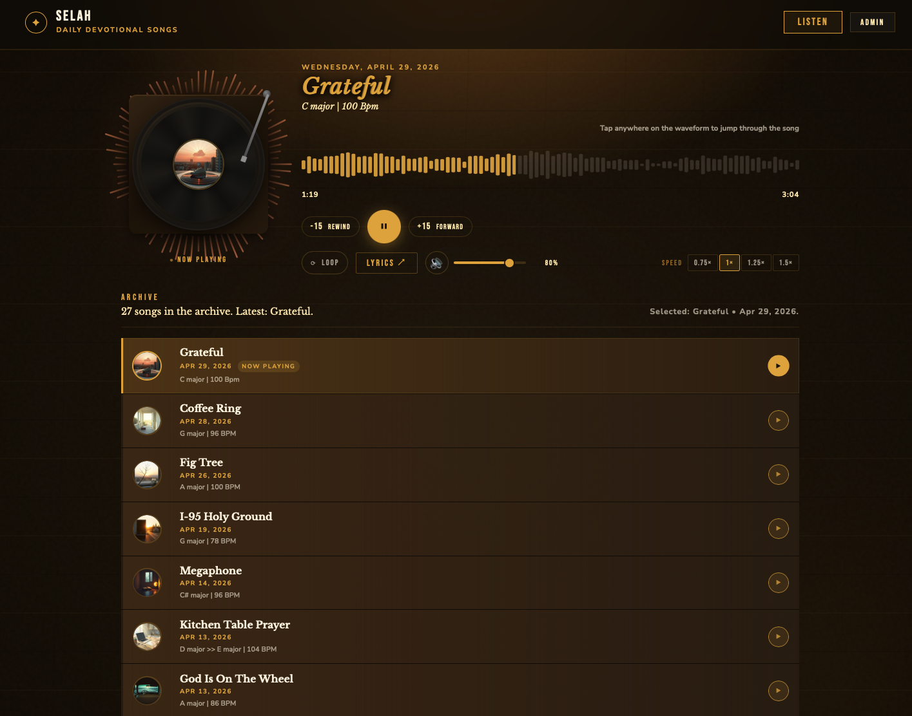
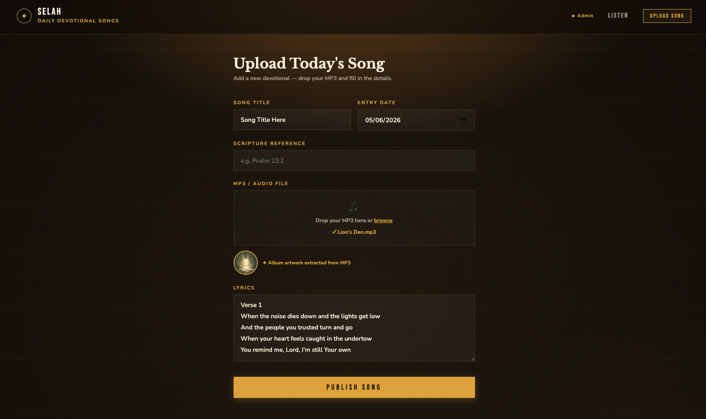
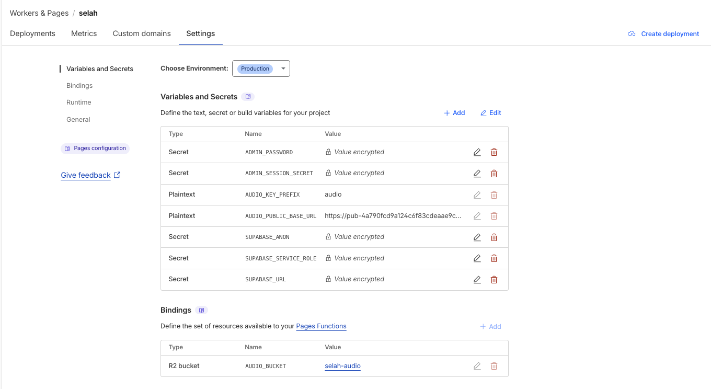
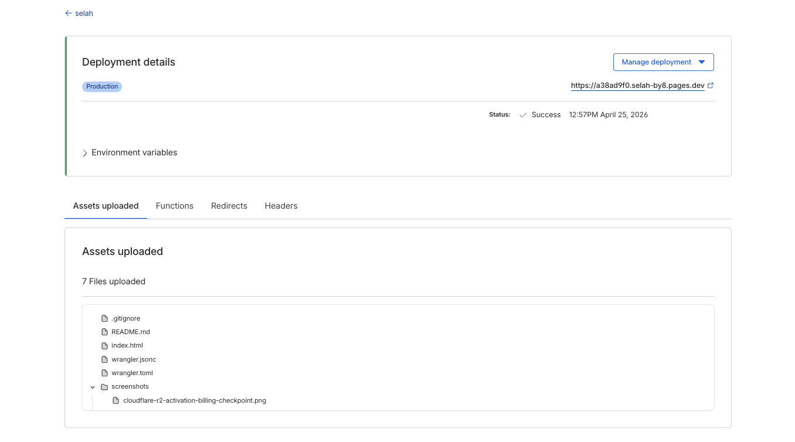

# SELAH

SELAH is a static-first devotional music web app for publishing and listening to daily songs with lyrics, scripture references, and album art. I built it as a single-page app in vanilla HTML, CSS, and JavaScript, with Cloudflare Pages/Functions handling deployment and secure admin actions, Cloudflare D1 storing devotional metadata, and Cloudflare R2 serving MP3 files and artwork.

[Live Demo](https://selah-by8.pages.dev/)

## What I Built

- Designed and shipped the listening UI, vinyl-style player, waveform seeking, lyrics modal, and archive browsing experience in vanilla HTML, CSS, and JavaScript.
- Implemented secure admin publishing with Cloudflare Pages Functions, signed session cookies, and server-side create/update/delete flows instead of browser-side write credentials.
- Migrated the project to a Cloudflare-only runtime with Pages, Functions, D1, and R2, then documented the architecture and decision tradeoffs in `docs/`.

## About

- Vinyl-inspired listening experience with waveform scrubbing, playback speed control, volume control, lyrics modal, and a progress-driven tonearm animation.
- Secure admin publishing flow backed by Cloudflare Pages Functions and signed session cookies instead of client-side credentials.
- Cloudflare-native storage model that keeps relational metadata in D1 and media files in R2.

## Screenshots

### Product UI

The recruiter-facing story starts with the product itself: a polished listening surface plus a lightweight publishing console for new songs.

#### Listen page



#### Admin upload page



## Tech Stack

| Layer | Technology |
| --- | --- |
| Frontend | Vanilla HTML, CSS, JavaScript |
| Client SDKs | `jsmediatags` (CDN) |
| Hosting | Cloudflare Pages |
| Serverless runtime | Cloudflare Pages Functions |
| Metadata database | Cloudflare D1 |
| Media storage | Cloudflare R2 |
| Config | `wrangler.jsonc` |

## Engineering Highlights

- Single-file frontend architecture: the UI, playback logic, archive rendering, and admin state live in one hand-editable `index.html` file for fast iteration without a framework build step.
- Secure write path: admin login, create, update, delete, audio upload, and artwork upload all run through server-side Functions using Cloudflare secrets and `HttpOnly` session cookies.
- Storage split by workload: D1 handles relational devotional records, while R2 handles public MP3 and artwork delivery.
- Playback UI tied to real audio state: the waveform, timing, play/pause state, and tonearm animation stay synchronized with the underlying `audio` element instead of decorative timers.
- Resilient archive loading: the public song list is served through a same-origin Pages Function backed by D1.

## Architecture

- [Architecture Overview](docs/architecture.md)
- [Architecture Decision Records](docs/adrs/README.md)

The deployed system is a static frontend on Cloudflare Pages with a thin Functions layer for admin auth and data mutations. Public readers fetch devotional metadata through a Pages Function backed by D1, while audio and artwork are delivered from Cloudflare R2.

### Deployment and Operations

These screenshots show the actual deployed runtime shape and the configuration surface behind the project.

#### Cloudflare Pages variables and R2 binding

Shows the production secrets/variables layer plus the `AUDIO_BUCKET` R2 binding used by Pages Functions.



#### Cloudflare Pages deployment details

Shows the production deployment snapshot and the static artifact shape for the Pages deployment.



#### Cloudflare R2 activation billing checkpoint

Captures the billing moment that forces explicit cost-awareness before object storage becomes part of the architecture.


## Project Structure

```text
.
├── .github/
│   └── workflows/
│       └── ci.yml
├── docs/
│   ├── architecture.md
│   └── adrs/
│       ├── README.md
│       ├── 0001-single-file-frontend.md
│       ├── 0002-cloudflare-pages-runtime.md
│       ├── 0003-split-media-and-metadata-storage.md
│       └── 0004-server-side-admin-writes.md
├── functions/
│   └── api/
│       ├── _auth.js
│       ├── _media.js
│       ├── _db.js
│       ├── admin-entry-create.js
│       ├── admin-entry-delete.js
│       ├── admin-entry-update.js
│       ├── admin-login.js
│       ├── admin-logout.js
│       ├── admin-session.js
│       ├── delete-audio.js
│       ├── devotionals.js
│       ├── upload-art.js
│       └── upload-audio.js
├── screenshots/
├── index.html
├── README.md
└── wrangler.jsonc
```

## Setup

### 1. Configure Cloudflare D1

Create a D1 database named `selah`, bind it to Pages Functions as `DB`, and apply this schema:

```sql
CREATE TABLE IF NOT EXISTS devotionals (
  id TEXT PRIMARY KEY,
  title TEXT NOT NULL,
  entry_date TEXT NOT NULL,
  scripture TEXT,
  lyrics TEXT,
  audio_url TEXT,
  art_url TEXT,
  created_at TEXT NOT NULL DEFAULT (strftime('%Y-%m-%dT%H:%M:%fZ', 'now')),
  updated_at TEXT NOT NULL DEFAULT (strftime('%Y-%m-%dT%H:%M:%fZ', 'now'))
);

CREATE INDEX IF NOT EXISTS idx_devotionals_entry_date
  ON devotionals(entry_date DESC);
```

### 2. Configure Cloudflare R2

Create an R2 bucket for media and bind it to Pages Functions as:

```text
AUDIO_BUCKET
```

This deployment uses `selah-audio` for both MP3 and artwork files, with separate `audio/` and `art/` object prefixes. Configure a public delivery base URL for playback and artwork, either with the default R2 public URL or a custom domain.

### 3. Configure Cloudflare Pages variables

Set these in Cloudflare Pages:

```text
ADMIN_PASSWORD
ADMIN_SESSION_SECRET
AUDIO_PUBLIC_BASE_URL
AUDIO_KEY_PREFIX
ART_PUBLIC_BASE_URL
ART_KEY_PREFIX
```

## Deployment

### Cloudflare Pages

1. Push the repository to GitHub.
2. Create a Cloudflare Pages project.
3. Connect the repository.
4. Leave the build command blank.
5. Set the output directory to `.`.
6. Add the required secrets, variables, the `DB` D1 binding, and the `AUDIO_BUCKET` R2 binding.
7. Deploy.

### Runtime endpoints

Static frontend:

- `/`

Pages Functions:

- `/api/devotionals`
- `/api/admin-login`
- `/api/admin-logout`
- `/api/admin-session`
- `/api/admin-entry-create`
- `/api/admin-entry-update`
- `/api/admin-entry-delete`
- `/api/upload-audio`
- `/api/upload-art`
- `/api/delete-audio`

## Privacy & Security

- Admin writes use Cloudflare secrets and `HttpOnly` session cookies.
- The browser only uses same-origin Pages Functions for reads and writes.
- D1 and R2 access stay inside the Functions layer through Cloudflare bindings.
- Audio and artwork deletions are handled server-side to avoid exposing storage credentials.

## Limitations

- The frontend remains intentionally monolithic; that keeps iteration fast but increases the size of `index.html`.
- There is no framework build step, which keeps the repo lightweight but also means stronger structure depends on discipline rather than tooling.
- Existing legacy data still requires an export/import step if it lives outside Cloudflare.
- There are no automated end-to-end browser tests yet; current checks focus on syntax and repository hygiene.

## Validation

Current repo-level checks used for this project:

- inline script parse check for `index.html`
- `node --check` on Pages Function files
- `git diff --check`
- GitHub Actions CI mirrors those validation steps on push and pull request

## License

Personal project / portfolio-style usage unless changed later.
