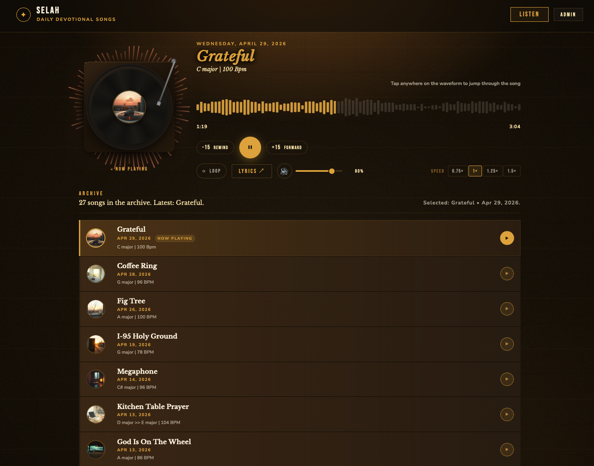
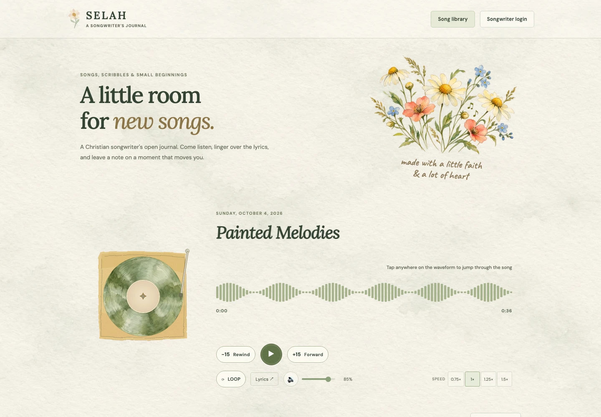
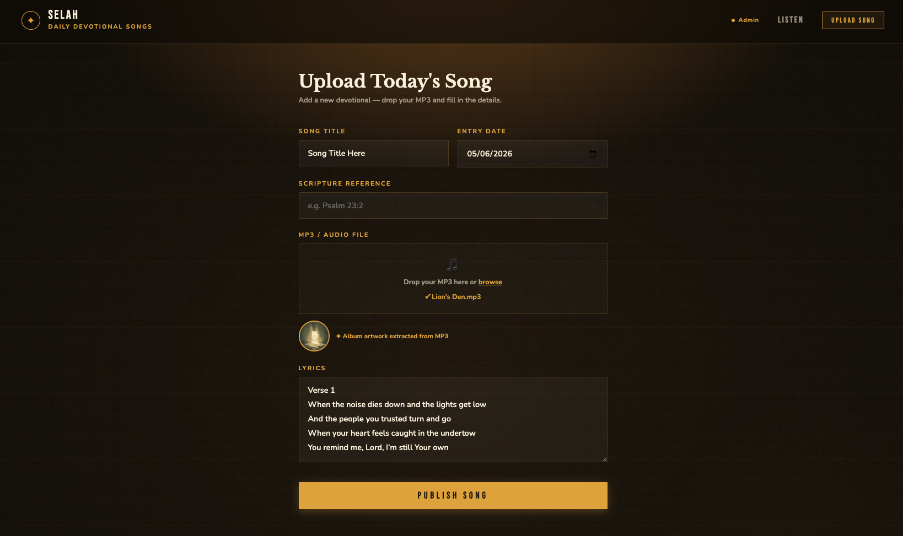
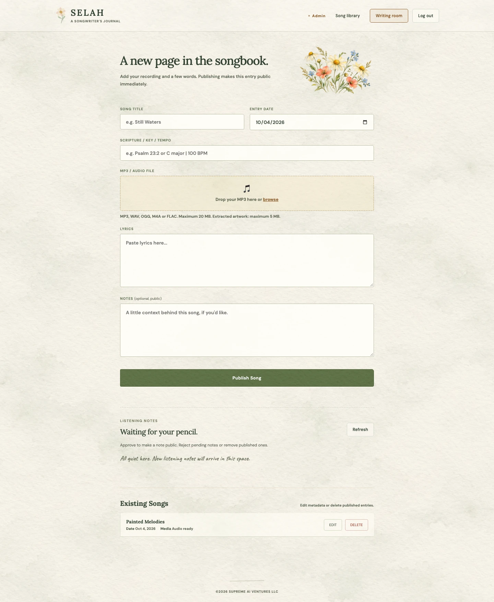
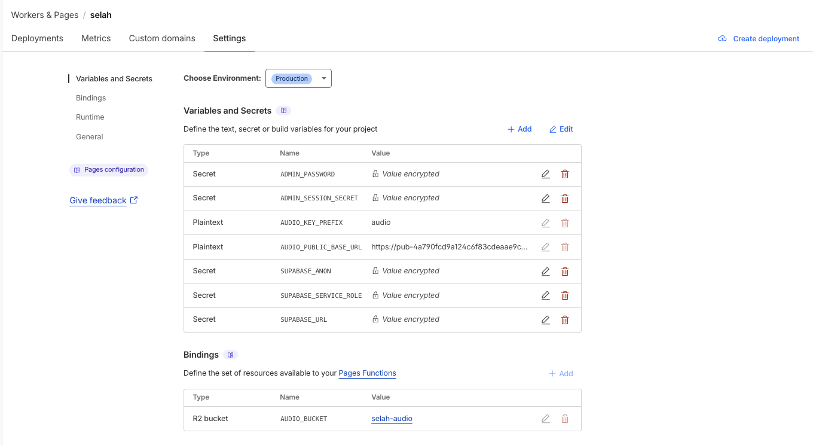
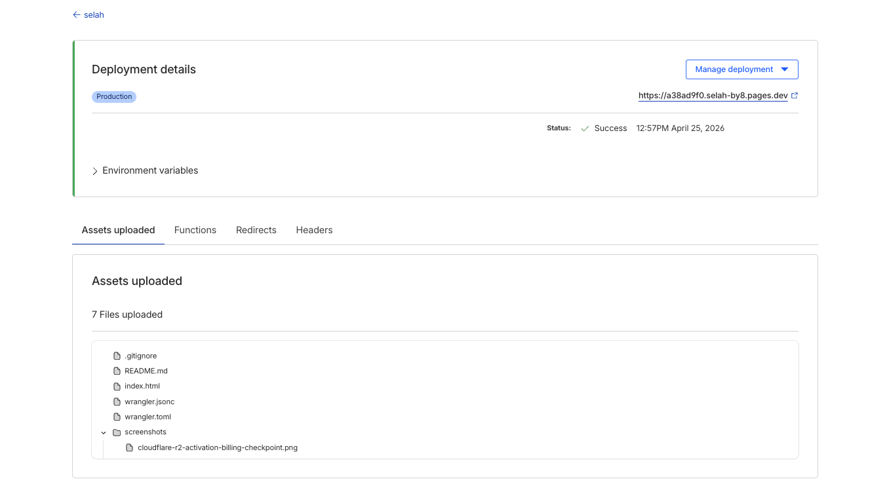

# SELAH

SELAH is a public song journal for a Christian songwriter: publish a recording with its lyrics and musical details, share a permanent song link, and collect guest feedback at specific moments in the recording. Listeners need no account. The songwriter approves feedback before it appears publicly. A warm watercolor-and-paper interface surrounds a vinyl player whose needle tracks the song's actual progress.

[Live Site](https://selah-by8.pages.dev/) | [Architecture](docs/architecture.md) | [Operations & Recovery](docs/operations.md)

[Visual design and original artwork](docs/visual-design.md) describes the rag-paper and watercolor treatment, asset provenance, and mobile layout rules.

The journal/feedback release requires the migrations and deployment settings below. Updating GitHub alone does not update a Direct Upload Pages project; deploy the built site as a separate release step.

## What I Built

- A framework-free listening experience with a real audio-derived waveform, pointer and keyboard seeking, lyrics dialogs, volume, speed, looping, and a progress-driven tonearm.
- A single-songwriter publishing console: create, edit, delete, optional public notes, and approval/rejection of timestamped guest feedback.
- Server-side authorization, signed sessions, bounded uploads, same-origin write protection, and database-backed submission limits.
- A Cloudflare runtime that separates relational records in D1 from audio/artwork in R2, with durable media-cleanup retries.
- An isolated local preview and automated browser tests against real local D1/R2 emulation.

## About

One deployment belongs to one songwriter. Every published song is public immediately; there are no drafts, private notes, visitor accounts, subscriptions, or collaborative editing.

Share a song using its `?song=<id>` link. The recipient lands on that recording without autoplay and can browse the rest of the songbook. Guests can leave a short note with an optional name and a playback timestamp. Pending notes are visible only in the songwriter's moderation queue.

## Art Direction: From Record Cabinet to Watercolor Journal

The October 2026 update moves SELAH from a dark-wood, amber-lit record cabinet to a bright, handmade songwriter's notebook. The goal was to make sharing an unfinished song feel welcoming and personal, without losing the distinctive record player or making the interface harder to use.

**Inspiration:** watercolor and ink on cotton-rag artist paper, with a Hahnemuhle-like tactile surface; botanical sketchbooks; and the irregular, wet-in-wet pigment patterns in my Bellyfloat game. These are material and composition references, not copied game scenery, manufacturer assets, or endorsements.

- **Paper before paint:** warm natural-white paper with irregular fibers and surface relief. An initially busy multicolor wash was reduced to a very pale sage wash distributed through the middle as well as the margins.
- **A handmade player:** an ochre painted plinth, sage watercolor record, wandering ink grooves, and an organically drawn arm mount. The needle still follows actual playback progress from 9 to 36 degrees; the artwork does not replace working controls.
- **Color with a purpose:** coral, yellow and blue stay concentrated in the botanical illustrations. Song selection, hover and keyboard focus borrow the soft blue of the flower petals. Quiet surfaces protect lyrics, forms and feedback.
- **A notebook, not a dashboard:** calmer serif typography, handwritten accents, more breathing room, and a consistent treatment across listening, lyrics and the writing room. Mobile reflows substantial artwork instead of hiding it or shrinking it into tiny decorations.

The [visual-design notes](docs/visual-design.md) document the original generated textures and illustrations, code-native SVG treatments, prompts, and accessibility guardrails. Existing sharing, publishing and moderation flows remain functional, and the waveform continues to represent the recording rather than decorative sample bars.

### Before / After

Before images are the original user-supplied screenshots. After images are captures of the running watercolor release in an isolated local demo, using a sample recording rather than production data. They illustrate the design, not an increase in the live song count.

| Before: dark-wood listening page | After: watercolor song journal |
| --- | --- |
|  |  |

| Before: original upload console | After: watercolor writing room |
| --- | --- |
|  |  |

[Mobile journal](screenshots/watercolor-journal-listening-mobile.webp) | [Selected and hovered song colors](screenshots/watercolor-journal-petal-blue-highlights.webp)

## Tech Stack

| Layer | Technology |
| --- | --- |
| Frontend | HTML, CSS, native JavaScript modules |
| Audio | HTML audio element; Web Audio for waveform analysis |
| MP3 artwork | jsmediatags via pinned CDN URL |
| Hosting / API | Cloudflare Pages / Pages Functions |
| Relational storage | Cloudflare D1 |
| Audio / artwork | Cloudflare R2 |
| Development / tests | Node.js 22+, Wrangler, Node test runner, Playwright |
| CI | GitHub Actions |

No frontend framework or production npm dependency is needed. Wrangler and Playwright are development dependencies. The build only copies public files into `dist/`.

## Engineering Highlights

- **Playback truth:** progress, seeking and needle position use the native audio element. Waveform heights come from decoded samples; failed analysis falls back to a clearly labeled seek bar. The decorative radial animation is not an audio spectrum.
- **Safe sharing:** permanent song IDs select a recording without restricting access to the public library.
- **Moderation boundary:** public reads filter to approved feedback in SQL. Approval, rejection and removal require an authenticated session.
- **Write protection:** independent 32+ character session secret, HttpOnly/Secure/SameSite cookies, same-origin POST checks, parameterized queries, input limits, and upload signature checks.
- **Retry-aware publishing:** a stable publication ID prevents duplicate entries during retries; successfully uploaded files are reused while the form stays open.
- **Storage lifecycle:** replacement/deletion enqueue cleanup in the same D1 batch as the metadata mutation. Unattached uploads are eligible for cleanup after 24 hours. Failed removals remain queued; referenced files are protected.
- **Deployment hygiene:** only the page, assets and public header/routing rules enter the web root. Tests, configuration, docs and local secrets are not published.

## Architecture

See the [container diagram and runtime flows](docs/architecture.md) and [decision records](docs/adrs/README.md).

## Local Setup

Requirements: Node.js 22+ and npm. No Cloudflare account, production credentials, or paid services are needed for local preview.

```sh
npm ci
npm run dev
```

Open [http://127.0.0.1:8788/](http://127.0.0.1:8788/). The local-only songwriter password is `local-preview-only`. The preview copies public metadata from the live archive on startup using INSERT OR IGNORE; it does not modify production or overwrite existing local entries. Local uploads use emulated R2. If the public archive is unreachable, the local journal starts empty and still supports publishing.

State lives under ignored `.wrangler/preview-state/`. The generated preview configuration uses an ephemeral session secret, so restarting the preview requires logging in again. Local previews are bound to loopback only.

Opening `index.html` directly or using a generic static server does not run the Pages Functions or D1 database. Use `npm run dev`.

## Production Setup & Deployment

1. Create/bind D1 as `DB` and R2 as `AUDIO_BUCKET`. Replace the account-specific database and bucket values in `wrangler.jsonc` for your deployment.
2. Back up existing D1 before applying migrations. Apply the migrations using `npx wrangler d1 migrations apply DB --remote`. Migration 0001 is compatible with the original table; migration 0002 adds notes, feedback, rate counters and cleanup receipts. Do not manually rerun migration 0002 after it has been applied.
3. Set encrypted Pages secrets `ADMIN_PASSWORD` and `ADMIN_SESSION_SECRET`. The signing secret must contain at least 32 random characters and must not equal the password. There is no password fallback.
4. Set `AUDIO_PUBLIC_BASE_URL`, `AUDIO_KEY_PREFIX`, `ART_PUBLIC_BASE_URL` and `ART_KEY_PREFIX`. Artwork defaults to the audio bucket; optionally bind `ART_BUCKET` separately.
5. Configure R2 public delivery with a production custom domain. For waveform analysis and artwork color extraction, allow GET/HEAD CORS from your Pages/custom domain. Update the `connect-src` entry in `_headers` when changing the media domain.
6. Build with `npm run build`, then deploy the existing Direct Upload project with `npx wrangler pages deploy dist --project-name selah --branch main`. GitHub pushes and Pages releases are separate for this project. If using Git integration for a different deployment, set the build command to `npm run build`, output directory to `dist`, and Node version to 22 or later. Configure production and preview bindings independently; do not point a testing deployment at production D1/R2.
7. Verify anonymous listening, songwriter login, publishing, sharing, and guest moderation after deployment. Pages does not apply D1 migrations automatically.

The local-only `/api/local-media/*` route returns 404 outside the isolated loopback preview. Never configure `LOCAL_PREVIEW` in production.

A hash-prefixed Pages deployment URL identifies a deployment snapshot. The base `selah-by8.pages.dev` hostname follows the active production deployment. Older snapshots can still call shared runtime resources; they are not database backups.

## Privacy & Security

- No visitor account, email collection, analytics tracker, or payment integration.
- Songs, lyrics, musical details, artwork and optional notes are public immediately.
- Guest names, comments and timestamps become public only after approval. Rejected comments are deleted. Approved comments can be removed by the songwriter.
- Feedback and login are limited to 5 and 10 submissions per IP per 15-minute fixed window respectively. D1 stores keyed hashes of the IP/window, not raw IP addresses; expired counters are removed on subsequent limited requests.
- Cloudflare and external font/CDN providers still receive ordinary network requests. This is not a promise of anonymous or zero-log hosting.
- Browser text is escaped; images are limited to JPEG, PNG, WebP and GIF uploads. SVG/HTML uploads are rejected. Audio is limited to 20 MiB and artwork to 5 MiB.
- Cookies expire after 14 days. Rotate the signing secret to invalidate all sessions; log out to remove the current browser's session.
- Never commit production secrets. If credentials have been shared publicly or exposed in a screenshot, rotate them.

## Operations & Deployment History

[Operations and recovery](docs/operations.md) covers backups, cleanup retries, smoke checks and known failure modes.

Historical screenshots show configuration, not current bindings or secret values:






The billing checkpoint documents why costs were reviewed before activating storage. Free allowances are not spending caps; review current provider pricing and usage.

## Project Structure

```text
index.html                Page structure
assets/                   Paper skin, illustrations, application and playback modules
functions/api/            Archive, publishing, sessions, feedback and media routes
migrations/               Versioned D1 schema changes
scripts/                  Public-asset build, validation and isolated local runtime
tests/                    Unit checks and browser/API journeys
docs/                     Architecture, ADRs and operations
screenshots/              Historical screenshots and labeled release demo captures
wrangler.jsonc            Production Pages/D1/R2 configuration
```

## Validation

```sh
npm run check
npm test
npm run build
npx playwright install chromium
npm run test:e2e
git diff --check
```

Browser tests start an isolated local Functions/D1/R2 runtime on port 8790. Only `.wrangler/test-state/` is reset. Test recordings and comments never enter production. Tests cover publishing and retry IDs, edit/delete, storage cleanup, guest moderation, deep links, clipboard sharing, seeking, mobile width, and failure states.

## Limitations

- This is a single-owner public journal, not a multi-tenant service or a private notebook.
- Rate limits reduce casual abuse but do not replace CAPTCHA or edge protection against distributed attacks.
- No scheduler runs cleanup automatically: authenticated successful POSTs and `/api/admin-maintenance` drain eligible receipts. An idle journal needs an operator maintenance run to remove unattached uploads.
- Waveform analysis downloads/decompresses the selected recording once per in-memory cache entry. Files are capped at 20 MiB, but very long compressed audio can still consume significant browser memory. Browser codec and CORS support affect analysis and playback.
- Public feedback returns the most recent 100 approved notes per song; moderation returns up to 200 notes, pending first. Pagination is deferred until the journal needs it.
- Automated browser coverage currently targets Chromium. Safari/iOS playback, sharing and screen-reader behavior still need real-device verification.
- No distributed transaction spans D1 and R2. Durable receipts make failed storage cleanup retryable, not instantaneous or guaranteed while the site is idle.
- A code rollback does not restore deleted database rows or media. Keep separate backups.

## License

Personal project / portfolio-style usage unless changed later.
