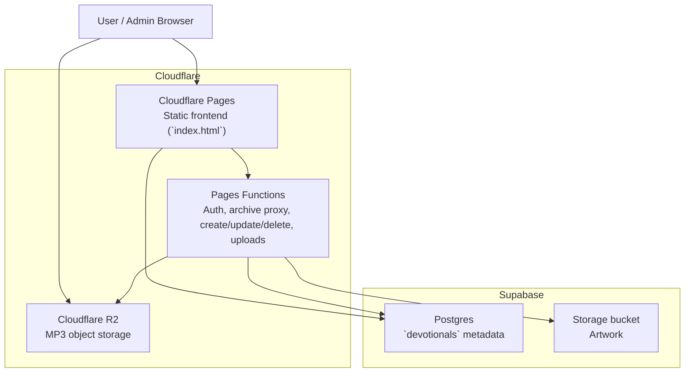

# Architecture Overview

SELAH is a static-first music application deployed on Cloudflare Pages. The runtime is intentionally small: a single HTML/CSS/JavaScript frontend, a thin Cloudflare Functions layer for auth and mutations, Supabase for devotional records and artwork, and Cloudflare R2 for MP3 storage.

## C4-Style Container Diagram

## Runtime Flow

### Public listening flow

1. The browser loads the static app from Cloudflare Pages.
2. The archive is requested through `/api/devotionals`, with client-side fallbacks to Supabase if needed.
3. Metadata returned from Supabase populates the archive, current track, lyrics, and playback state.
4. MP3 playback uses the public R2 URL stored on each devotional row.
5. Artwork is loaded from Supabase Storage public URLs.

### Admin publishing flow

1. The admin logs in through `/api/admin-login`.
2. A Pages Function validates the password against Cloudflare secrets and sets an `HttpOnly` session cookie.
3. Audio uploads are posted to `/api/upload-audio` and written to R2.
4. Extracted artwork uploads are posted to `/api/upload-art` and written to Supabase Storage.
5. Final devotional metadata is created or updated through `/api/admin-entry-create` or `/api/admin-entry-update`.
6. Delete operations call `/api/admin-entry-delete`, which removes the devotional row and cleans up referenced media.

## Deployment Shape

- Static asset: one `index.html` file served by Cloudflare Pages.
- Function layer: files under `functions/api/`, deployed as Pages Functions.
- Object storage: `AUDIO_BUCKET` R2 binding configured in `wrangler.jsonc`.
- Database/storage dependencies: Supabase URL, anon key, and service-role-backed server-side access.
- Public live URL: [https://selah-by8.pages.dev](https://selah-by8.pages.dev)

## Key Constraints

- The app stays framework-free and build-free on purpose.
- Public reads remain possible from the browser, so Supabase anon access is limited to read-only use.
- Audio and artwork live in different storage systems, which improves cost and delivery characteristics but adds integration points.
- The frontend is still monolithic, which is efficient for a small app but raises future maintenance pressure if features keep expanding.

## Notable Implementation Choices

- Archive resilience comes from a server-side proxy plus client-side fallback chain.
- Admin writes are server-side only; the browser never receives the service role key.
- Tonearm animation and waveform progress are driven from real audio state instead of independent timers.
