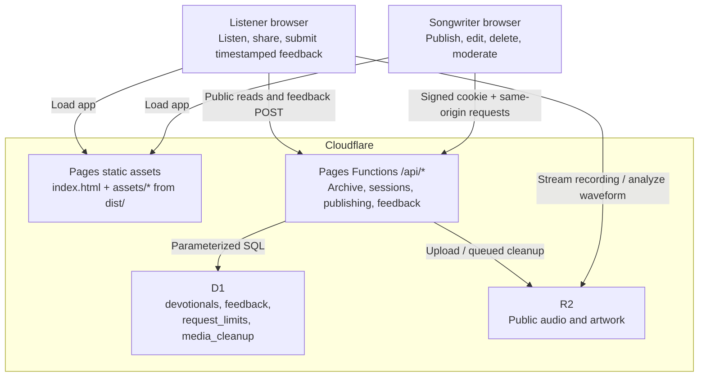

# Architecture Overview

SELAH is a single-owner public songwriting journal. Cloudflare Pages serves static HTML/CSS/native JavaScript modules. Pages Functions authorize publishing and moderation, D1 stores song records and listening notes, and R2 delivers public audio/artwork. There is no visitor account or payment service.

## C4-Style Container Diagram

```mermaid
flowchart TB
    listener["Listener browser<br/>Listen, share, submit timestamped feedback"]
    writer["Songwriter browser<br/>Publish, edit, delete, moderate"]

    subgraph cloudflare["Cloudflare"]
        pages["Pages static assets<br/>index.html + assets/* from dist/"]
        functions["Pages Functions /api/*<br/>Archive, sessions, publishing, feedback"]
        db["D1<br/>devotionals, feedback,<br/>request_limits, media_cleanup"]
        media["R2<br/>Public audio and artwork"]
    end

    listener -->|"Load app"| pages
    writer -->|"Load app"| pages
    listener -->|"Public reads and feedback POST"| functions
    writer -->|"Signed cookie + same-origin requests"| functions
    functions -->|"Parameterized SQL"| db
    functions -->|"Upload / queued cleanup"| media
    listener -->|"Stream recording / analyze waveform"| media
```

## Runtime Flow

### Listening and sharing

1. Static modules request the public songbook from `GET /api/devotionals`.
2. `?song=<UUID>` selects a shared song without autoplay. The library remains available.
3. Native audio streams the public media URL. Audio state drives elapsed time, seeking and the 9–36 degree needle sweep.
4. Web Audio decodes the selected recording to generate waveform peaks. An in-memory cache holds up to five peak arrays. Failed decoding/CORS produces an explicit progress-bar fallback.
5. Approved notes are fetched through `GET /api/feedback?entryId=<UUID>`. Timestamp buttons seek to the associated moment.

### Guest feedback

1. A guest selects a timestamp and submits an optional name and a short comment to `POST /api/feedback`.
2. Same-origin validation, a bounded JSON body, field validation and an atomic D1 IP/window counter protect the submission boundary.
3. The note is stored with status `pending`. Public SQL queries cannot retrieve it.
4. Authenticated `/api/admin-feedback` routes list pending/approved notes and approve or delete them.

### Publishing

1. Login checks the password and a D1 rate counter, then sets a signed, 14-day HttpOnly/Secure/SameSite cookie.
2. R2 uploads validate extension, initial file signature and a byte limit. A D1 receipt tracks each unattached upload.
3. Metadata creation uses a stable client-generated UUID for retries. Public notes remain optional.
4. Updates/deletes enqueue old media URLs in the same D1 batch as metadata changes. Removing a song also removes its feedback.
5. Successful authenticated POSTs schedule bounded cleanup through `waitUntil`. Referenced files are retained; failed removal remains in D1 for retry.

## Deployment Shape

- Build: Node copies public page/assets/header/routing files to `dist`; no bundler.
- Pages Git integration: `npm run build`, output `dist`, Node 22+.
- Functions: source under `functions/api/`, included only for `/api/*`.
- D1: `DB` binding and versioned SQL migrations.
- R2: `AUDIO_BUCKET`, optionally `ART_BUCKET`; public base URLs identify managed media.
- Secrets: independent admin password and 32+ character signing secret, configured in Pages.
- Local runtime: isolated D1/R2 emulation, loopback-only media delivery, and public metadata copied read-only from the live site.
- Tests: separate isolated D1/R2 state and Chromium browser/API journeys.

## Constraints

- One owner and one public journal per deployment; no tenant isolation or private drafts are implied.
- D1 and R2 cannot share a distributed transaction. Cleanup receipts offer recoverability, not instantaneous deletion.
- Cleanup has no automatic scheduler. An idle site needs operator maintenance for eligible unattached files.
- Rate limiting is a modest single-journal safeguard, not a distributed anti-abuse system.
- Native waveform decoding depends on browser codecs/CORS and can use substantial memory for long recordings.
- Static headers apply to assets; API middleware handles write-origin checks and no-store/nosniff responses. No HTML-rewriting middleware remains.
- [Operational recovery](operations.md) requires separate database and media backups.
